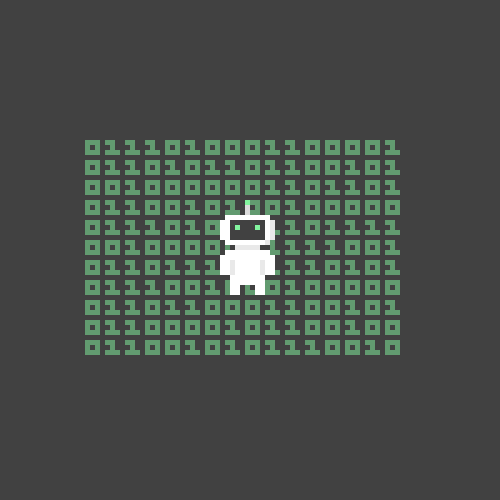

<h1 align="left">Hi 
  , I'm José Messias
</h1>

 
   

 Sou um entusiasta da tecnologia e estudante de Análise e Desenvolvimento de Sistemas, em constante busca por novos aprendizados e oportunidades.
 Atualmente estou consolidando meus conhecimentos em Flutter, C# e Banco de Dados.

 

## 🛠 &nbsp;Tech Stack

  

## 📧 Contact

  
  

## ⚙️ &nbsp;GitHub Analytics

  
  <a href="https://github.com/JoseCMessias">
  
  

